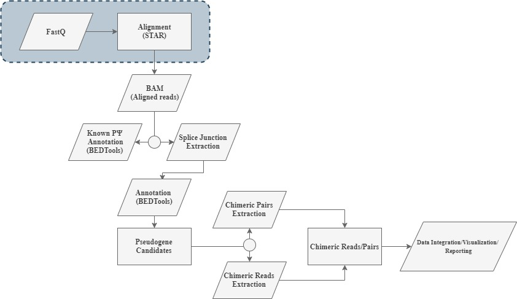
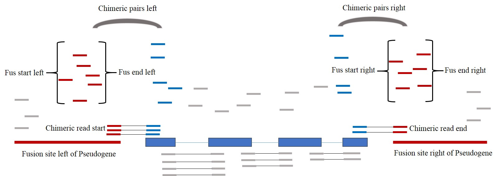

# Pseudogenes

## Introduction  
PpsyFinder is pipeline for detecting novel processed pseudogenes using DNA sequencing data (Exomic, Genomic, Targeted gene panels etc). 
Processed pseudogenes are structures that are reintroduced into the genome by retrotransposition. This feature is used by Ppsy finder that detects pseudogene candidates by searching for spliced genes withing the genomic sequencing data. Insert positions of the pseudogene candidates are recorded by linking the pseudogene candidate with softclipping (chimeric reads) and read pair insert sizes (chimeric pairs). The idea of this is dependent on an splice aware aligner that allows softclipping and chimeric read pairs. The figure below contains the overall workflow. 


  
## Installation 

The recommended way of installing the tool is through Anaconda. 

First step is to create a conda evironment for Ppsy which builts upon python 2.7 and load the newly built conda environment using source activate 

```

conda create -n Ppsy python=2.7
source activate Ppsy 

```

When the conda environment for Ppsy is loaded we download the latest version of the tar.ball from the Ppsy github repo and install the downloaded tarball using pip. 

```

wget https://github.com/SannaAb/Pseudogenes/archive/v.0.1.9.tar.gz

pip install v.0.1.9.tar.gz

```
The required python modules (pandas, pysam and psutil) will be installed. 
You can make sure that everything was installed correcly by typing Ppsy.py within your environment.


### Other dependencies 

Ppsy is also dependent on some tools outside of python. You need to have these tools within your path to make sure that the script works correctly. You can install these tools within your environment using anaconda as well. Make sure that you have source activated your environment first. 

```

conda install -c bioconda bedtools
conda install -c conda-forge -c bioconda samtools bzip2
conda install -c bioconda star
conda install -c bioconda bioconductor-gviz
conda install -c conda-forge ncurses # (?)


```

## How to run 

Ppsy takes either the two paired quality filtered fastq files or the alignment file as input. How to run the tools on either input is described below. 

### How to run Ppsy using the Fastq files as input

If the input to Ppsy is fastq files then you need to create a star index for the human reference genome (hg19). The output index will be used in Ppsy. We suggest that you use the following code snipped for creating an index for the reference genome. Be aware that the indexing step is time consuming and does require a high amount of memory. You only need to create the index once but make sure that you use the same version of star for creating the index that you use for running Ppsy. 


```

STAR --runMode genomeGenerate  --genomeFastaFiles /path/to/humangenome19/fasta/file \
--sjdbGTFfile /path/to/humangenome19/gtf/file --genomeDir /path/to/starindex/

```

When the index is created you can run Ppsy using the following code snipped these are all the required parameters for running Ppsy. 

```

Ppsy.py --method Fastq -STARindex /path/to/starindex/ -S Sample \ 
-R1 /path/to/file_1.fq.gz -R2 /path/to/file_2.fq.gz

```

The parameters are described below 

* Required Parameters when method is Fastq

  * --Method Fastq 
  * -R1	Path to fastq1 (required), works for both gziped fastq files and fastq files 
  * -R2 Path to fastq2 (required), works for both gziped fastq files and fastq files
  * -STARindex path to the indexed reference genome 
  * -S Name of the output which all the results for that sample will be stored 

### How to run Ppsy using the Bam file as input


If the input to Ppsy is a bam file the file must have been created using STAR with the chimic reads within option. The resulting alignment file need to have been mapped towards the human h19 reference genome. The corresponding index file for the bam need to be within the same folder as the bam itself.
You can tweak the parameters --outFilterMultimapNmax and --chimSegmentMin for your preference but we sugguest to run STAR in the following manner. 

```

STAR --genomeDir /path/to/starindex/ --chimOutType WithinBAM --outSAMunmapped Within \
--outFilterMultimapNmax 20 --chimSegmentMin 20 \ 
--outSAMtype BAM SortedByCoordinate --outFileNamePrefix Path/to/OutPrefix/ \
--readFilesIn path/to/file_1.fq path/to/file_2.fq 

```

When you have an alignment file for the hg19 reference genome you run the following code snippet with the required parameters.

```{python}

Ppsy.py --method Bam -S Sample -I /path/to/input.bam 

```

* Required Parameters when method is Bam 

  * --method Bam
  * -I path to Bamfile (required)
  * -S Name of the output which all the results are stored


### Optional parameters for the methods Bam and Fastq 

Below are the optional parameters to use when input is either Fastq or Bam

* Optional Parameters

  * --pseudoCandidateDepth (default 5), The minimum depth that supports the splice junctions, this give rise to the processed pseudogene candidates
  * --InsertDistance (default 200 000), What is the distance from the parent gene where we can have an pseudogene, low distance might increase the amount of detected pseudogenes but will also increase the amount of false positives. A low distance and you might hit inserted pseudogenes in the parent gene itself which is not very likely
  * --ChimericPairDepthTreshold (default 10), The minimum amount of reads to suppport the chimeric pairs in the left anchor, absolute minimum is 5. 
  * --ChimericPairBinningTreshold (default 500), When the chimeric pairs are binned into the anchors the binning distance defines the distance for the read to belong to same bin 
  * --ChimericReadDepthTreshold (default 10), The minimum amount of reads to support the chimeric reads in the insert site, absolute minimum is 5. 
  * --ChimericReadBinningTreshold (default 10), When the chimeric reads are binned into the anchors the binning distance defines the distance for the read to belong to same bin
  * --MergeChimReadWithChimpairTresh (default 100), When we are combining the results from the chimeric pairs and the chimeric reads we combine them if the chimeric read are withing the chimeric pair anchors or the chimeric read are in a user defined distance from the left anchor
  

## Summary reports 

If you run multiple samples you can run the summary report scripts to obtain an overview of what is found in your samples. 
There are two scripts in ppsy that will give you this. 

#### html report 

The html report contain the pseudogenes detected in each sample together with the evidence from chimeric reads and pairs that support the pseudogene. Links for the original report and the known pseudogene report is included together with the gviz picures displaying the coverage of the pseudogene and its insert site. 

To construct this report run code as follows

```

# if you use format loose (default) all pseudogenes with corresponding insertsite is reported

MakePPsyReport_html.py -I Sample1_PPsyOut Sample2_PPsyOut -O OUTFOLDER -f loose

# if you use format strict only pseudogenes with chimeric pairs and chimeric read evidence are reported

MakePPsyReport_html.py -I Sample1_PPsyOut Sample2_PPsyOut -O OUTFOLDER -f strict

```

#### Excel report

If you use the html report it is important that the original file structure is saved as the report is linking to the output file paths. If you want to get an overview without this drawback from the links you can use the excell report. This report is to prefer if you quickly want to sort the results in different manners. It will contain all hits without any strict filtering. 

```

MakePPsyReport_excel.py -I Sample1_PPsyOut Sample2_PPsyOut -O OUTFOLDER

```

## Ppsy Idea 

The main goal of PPsy is to detect inserted processed pseudogenes within human DNA sequencing data. The pipeline is utilizing the fact that processed pseudogenes does not contain any introns. Pseudogene candidates are detected as genes contaning spliced reads across the exon exon junctions. The insert site of the pseuedogene candidates are identified with chimeric read pairs and chimeric reads. 

The figure belows displays an insertion of a pseuogene within another position in the genome. Reads that maps across the splice juncion of the gene that have been inserted is displayed in the figure below. These reads mapps across the known exon exon of the parent gene. Genes with this form of alignment will be used as a pseudogene candidates. This pseudogene candidates are linked to fusions sites using chimeric pairs and chimeric reads. The reads at the fusion site are colored red. The reads mapping at the pseudogene are colored blue. Chimeric pairs are the read pairs were one of the reads read mapps across at the fusion site and its associated read mapps at the pseudogene itself. The chimeric reads are reads that maps at the splice junctions of the fusion. One part of the read will belong to the fusion site while the other part belong to the pseudogene. 



### Discovering Pseudogene candidates 

The Spliced reads are extracted by screening for the cigarN in the alignment file the resulting reads are saved in an alignment file. Regions with a user defined depth (default 5) is extracted from the newly created alignmentfile, extracted regions with overlapp of atleast 3 exons in an exon coord database are saved as our detected pseudogene candidates. When no pseudogene candidates are found the script is killed. 

### Clipped read extraction 

Clipped reads are reads that are split so one part of the read mapps at one site in the genome and the other part mapps in another site. The Clipped reads are defined in the STAR alignment by the tag SA:. If pseudogenes candidates were detected the clipped reads are extracted and saved in a new alignmentfile. 

### Chimeric read extraction

Chimeric reads are reads with larger insertsize than expected. If pseudogenes candidates were detected the chimeric read pairs are extracted based on a userdefined insertsize treshold, default is 200 000. To small insertsize might increase the amount of false positives. The chimeric read pairs are saved in a new alingment file. 

### Chimeric read overlapp with Pseudogene candidates 

Reads are binned together if they are not further away then a userdefined distance from the starting point. The default distance is 500. Bins are saved if you have enough reads supporting it. The user defines the treshold (default 10, minimum 5). 
The first anchors are called the left anchors, if the following read pairs insert anchor is within the distance from starting out of the insert but further away then 5000 bp from the pseuendogene anchor we have hit the right anchors. The right anchors are binned in the same manner as the left ones.

### Clipped reads binning 

The genome coords from the clipped reads are extracted from the clipped alignment file. The clipped reads are saved in ranges if they are within a userdefined distance from the first read (default is 10) for both the first part of the read and the second part of the read. If the amount of user defined supporting reads are enough (default 10, minimum 5) the range is saved. If either part of the read range is within the coordinate as a pseodogenecandidate the softclipping insert point is saved. 

### Combining clipped reads with chimeric read pairs evidence 

The support for the fusions from both chimeric read pairs and clipped reads are combined. The optimal fusion have evidence from both chimeric read pairs (both the left and the right anchor) and the clipped reads. 


### Insert point annotation 

The insert points are annotated using the ensembl gene annotation for HG19. If the fusionpoint is detected using the clipped reads the clipped read start coord sets the annotation of the insert point. If the insert point does not have evidence from the the clipped reads the insert left anchor start point is used. 

### Plotting 

The coverage is plotted using GVIZ by default.


### Known pseudogene annotation 

The known pseudogenes are annotated using the known processed pseuodogene coordinates from ensembl (hg19).

## Memory Cons... 

There is no easy way of implementing the total memory consumtion for the script as it is constantly changing to new processes. The easiest way is instead of running the memory profiles which is a python tools that allows you to plot the memory consumtion through time together with the main scripts child processes. 

See examples of how to run it below 

```

mprof run --include-children ../Scripts/Ppsy.py --Method Bam -I SMAD4_chr12_580000_ORD.r1.fqAligned.sortedByCoord.out.bam -S SMAD4_chr12_580000

mprof plot mprofile_20190925095608.dat --title STAR -O STAR_test 

```
